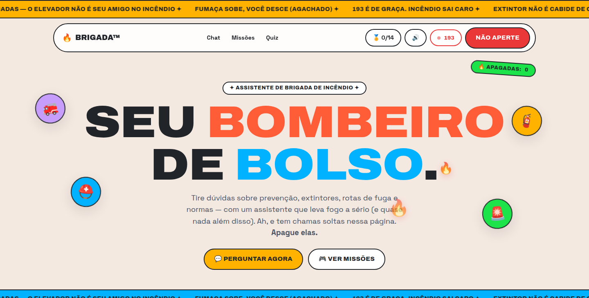
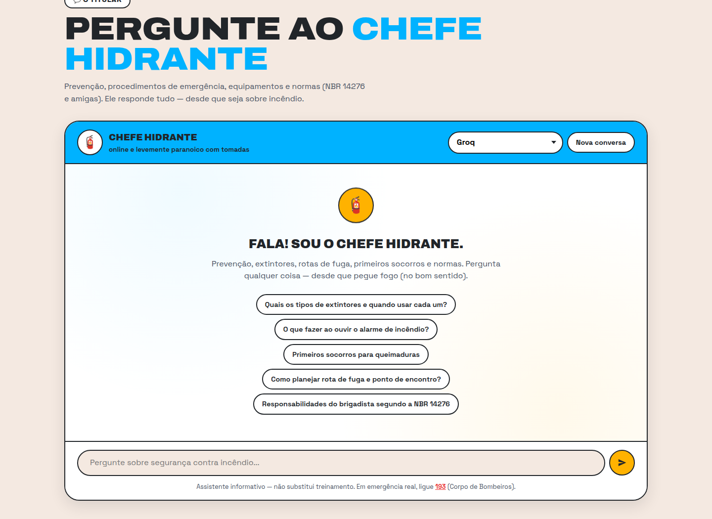
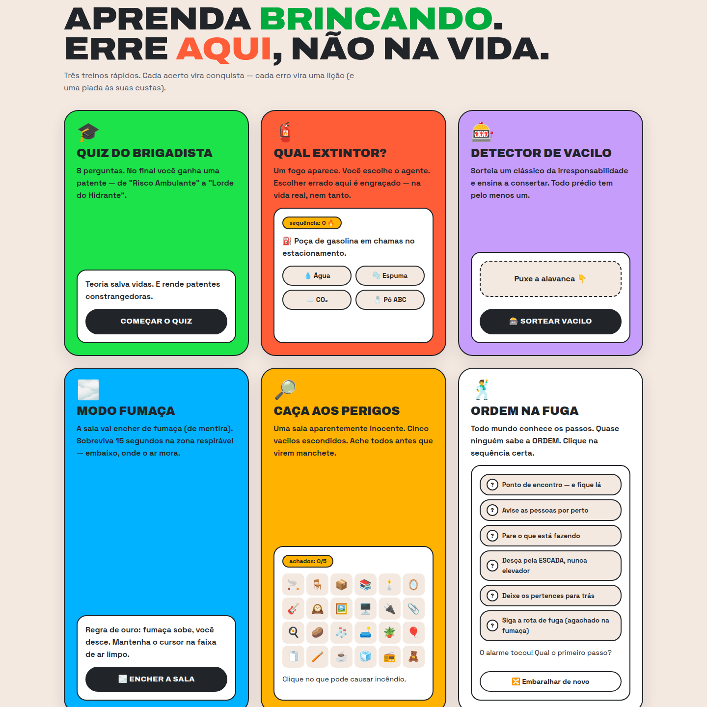
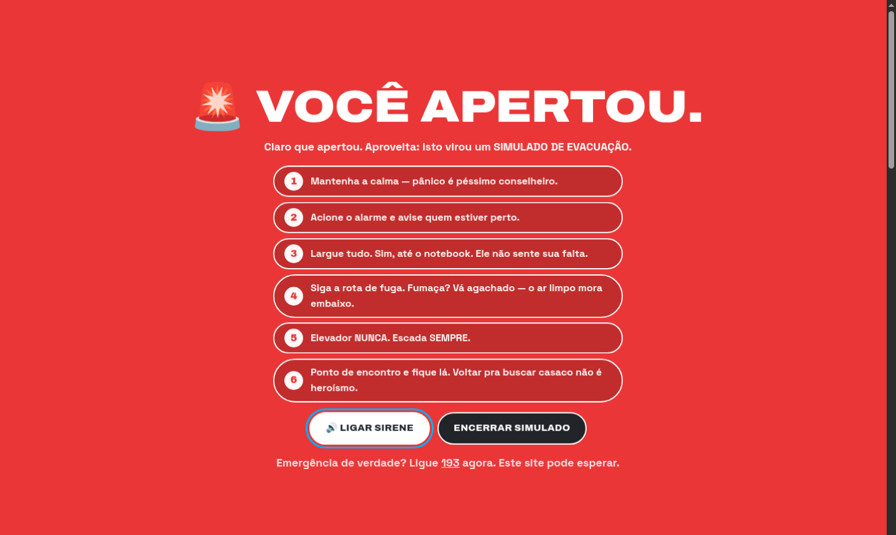

<div align="center">

# 🧯 BRIGADA™ — Seu bombeiro de bolso

### Chatbot de brigada de incêndio + parquinho de treinamento.
**Didático, cômico e levemente paranoico com tomadas.**




*"USE AS ESCADAS — O ELEVADOR NÃO É SEU AMIGO NO INCÊNDIO"* — o marquee da página, filosofando

</div>

---

## 🔥 O que é isso?

Um site que ensina **segurança contra incêndio** de dois jeitos ao mesmo tempo:

1. **Conversando** — um chatbot especialista (o *Chefe Hidrante*) que responde sobre prevenção, extintores, rotas de fuga, primeiros socorros e normas (NBR 14276, NBR 12693, NBR 9077...), com streaming em tempo real.
2. **Brincando** — 15 mecânicas interativas onde errar é engraçado *aqui* pra você não errar *na vida real*.

Design inspirado no [units.gr](https://units.gr/en/homepage/): **soft neubrutalism** — fundo creme, bordas pretas grossas, cores vivas, tipografia display gigante, pills e stickers. Completam a página: números "auditados pela samambaia", depoimentos (mentirosos), FAQ implicante, selo giratório e um botão que negocia com você.

## 💬 O Chefe Hidrante

<div align="center">

</div>

- **6 provedores de IA** à escolha: Groq, Grok, Gemini, ChatGPT, DeepSeek e Claude — troca no seletor, sem recarregar.
- **Streaming** — a resposta aparece enquanto o modelo digita.
- **Detecção de emergência** — mensagens tipo "tá pegando fogo AGORA" disparam banner mandando ligar **193** antes de qualquer papo.
- **Markdown seguro** — renderizador próprio, com HTML escapado (e teste automatizado).
- Histórico só no navegador (`localStorage`). Nada vai pro servidor.
- Status de digitação cômico: *"consultando a NBR 14276..."*, *"procurando o pino do extintor..."*

## 🎮 As 15 mecânicas

<div align="center">

</div>

| # | Mecânica | O que ensina |
|---|----------|--------------|
| 🔥 | **Apague as chamas** — chamas soltas no hero, cursor vira extintor, clique solta espuma | Reflexo de "viu fogo, age" |
| 📰 | **Marquee de dicas** — faixa infinita misturando dica real e zoeira | Prevenção em pílulas |
| 🎓 | **Quiz do Brigadista** — 8 perguntas sorteadas de um banco de 16, patente no final (de *Risco Ambulante* a *Lorde do Hidrante*) | Classes de fogo, normas, primeiros socorros |
| 🧯 | **Qual extintor?** — cenário aparece, você escolhe o agente | Água ≠ óleo quente ≠ quadro elétrico |
| 🚨 | **Botão "NÃO APERTE"** — vira simulado de evacuação com sirene (WebAudio) e 6 passos | Procedimento de abandono de área |
| 🎰 | **Detector de Vacilo** — caça-níquel de irresponsabilidades clássicas + como corrigir | NBR 12693, NBR 9077 na prática |
| 🌫️ | **Modo Fumaça** — a tela enche de fumaça; sobreviva 15s na zona respirável | Fumaça sobe, você desce |
| 🔎 | **Caça aos Perigos** — 5 vacilos escondidos numa sala de 24 itens | Olhar de inspetor |
| 🕺 | **Ordem na Fuga** — os passos da evacuação embaralhados; clique na sequência certa | A *ordem* importa |
| 📜 | **Diploma de Brigadista de Sofá** — certificado PNG gerado no canvas, com seu nome e patente | Recompensa (questionável) |
| 🏅 | **15 conquistas** — toasts + galeria, salvas no navegador | Progresso e rejogabilidade |
| 🏆 | **Placar "dias sem incêndio"** — zera quando você erra o extintor | Vergonha pedagógica |
| 🔊 | **Sons em WebAudio** — sirene, acertos, erros, fanfarra (sem nenhum asset de áudio; tem botão de mudo) | Feedback |
| 📟 | **Easter egg** — digite `193` em qualquer lugar da página | O número que importa |
| 🃏 | **Zoeiras espalhadas** — depoimentos (mentirosos), FAQ implicante, números "auditados pela samambaia", selo girante, stickers fofoqueiros, botão que negocia, aba que chora quando você sai, recado no console | Atenção é retenção |

<div align="center">

</div>

## 🚀 Rodando localmente

```bash
python3 app.py
```

Só isso. O `app.py` da raiz usa o venv do projeto automaticamente e sobe em `http://localhost:5000`.

Primeira vez? Instale as dependências e configure ao menos uma chave:

```bash
python3 -m venv venv
venv/bin/pip install -r backend/requirements.txt
cp .env.example .env   # preencha ao menos uma chave de API
python3 app.py
```

## 🔑 Provedores de IA

Providers sem chave no `.env` aparecem desabilitados no seletor.

| Provedor | Variável no `.env` | Modelo padrão |
|----------|--------------------|---------------|
| 🟠 Groq | `GROQ_API_KEY` | llama-3.3-70b-versatile |
| ⚫ Grok (xAI) | `XAI_API_KEY` | grok-3 |
| 🔵 Gemini | `GEMINI_API_KEY` | gemini-2.5-flash |
| 🟢 ChatGPT | `OPENAI_API_KEY` | gpt-4o-mini |
| 🟣 DeepSeek | `DEEPSEEK_API_KEY` | deepseek-chat |
| 🟡 Claude | `ANTHROPIC_API_KEY` | claude-sonnet-5 |

## ☁️ Deploy

Tem `backend/Procfile` pronto (Render/Railway/Heroku e afins) usando gunicorn:

```
web: gunicorn --bind 0.0.0.0:${PORT:-8000} app:app
```

Aponte o *root directory* do serviço para `backend/`. Com a variável `PORT` definida, o modo debug desliga sozinho. Configure as chaves de API como variáveis de ambiente do serviço.

## 🗂️ Estrutura

```
├── app.py              # ponto de entrada (acha o venv sozinho)
├── backend/
│   ├── Procfile        # deploy com gunicorn
│   ├── app.py          # Flask: rotas / e /chat (streaming)
│   ├── config.py       # system prompt + provedores
│   └── providers.py    # adapter OpenAI-compatível + Anthropic
└── frontend/
    ├── index.html      # landing + chat + missões
    ├── css/style.css   # design system (tokens, animações)
    └── js/
        ├── chat.js     # chat, streaming, markdown seguro
        └── site.js     # as 15 mecânicas
```

## 🧪 Testes

Self-checks executáveis direto, sem framework:

```bash
cd backend
python test_config.py
python test_providers.py
python test_app.py
node ../frontend/js/test_md.js   # renderizador de Markdown do chat
```

## 🎨 Design

Estilo: **soft neubrutalism** (neo-brutalismo suave) — bordas pretas de 2px, cantos bem arredondados, sombras suaves, cores chapadas e tipografia expandida. Paleta e linguagem visual inspiradas no [units.gr](https://units.gr/en/homepage/):

| | Cor | Uso |
|--|-----|-----|
| 🟤 | `#f4e9e1` creme | fundo |
| ⚫ | `#212529` tinta | texto e bordas |
| 🟡 | `#ffb200` amarelo | destaque, marquee |
| 🔵 | `#00b2ff` azul | chat |
| 🟢 | `#1be349` verde | quiz, acertos |
| 🟣 | `#ab54f7` roxo | vacilo, diploma |
| 🟠 | `#ff5c38` laranja | extintor |
| 🔴 | `#ea3737` vermelho | pânico, 193 |

Fontes: **Archivo** (display, expandida) + **Space Grotesk** (texto). Animações respeitam `prefers-reduced-motion`.

---

<div align="center">

## ⚠️ O aviso sério

**Este site é informativo e não substitui treinamento oficial de brigada.**
Em emergência real, ligue **[193](tel:193)** (Corpo de Bombeiros) — de graça, de qualquer telefone.

<br />

Feito com 🧯, dicas de verdade e um humor questionável por
### [Lucas Gonzaga](https://github.com/licasmp4)

*Validade deste README: até o próximo vacilo.*

</div>
